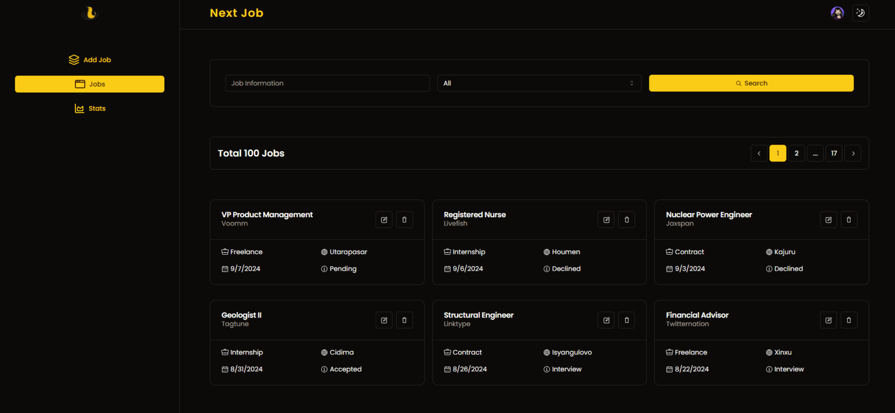

# Next Job

> Next Job enables users to create and manage their own job application lists while tracking the progress of each application. As users add new jobs and time passes, the platform offers insightful data and visualizations, allowing users to review their past applications and monitor trends over time.

## Table of Contents

- [Live Demo](#live-demo)
- [Screens](#screen)
- [Features](#features)
- [Technologies Used](#technologies-used)
- [Getting Started](#getting-started)
- [License](#license)

## Live Demo

- You can access the live demo via [Vercel](https://burakbilgili-nextjob.vercel.app).

## Screens

[](https://burakbilgili-nextjob.vercel.app)
[](https://burakbilgili-nextjob.vercel.app)

## Features

**Here are some of the current features that Next Job has:**

- [x] User authentication
- [x] Route protection
- [x] Job listing
- [x] CRUD operations
- [x] Advanced search
- [x] Charts and analyses
- [x] Loading skeletons
- [x] State management
- [x] Responsive design

## Technologies Used

**Next Job uses the following technologies:**

- [Next.js](https://nextjs.org/)
- [React](https://reactjs.org/)
- [React Query](https://tanstack.com/query/v3)
- [Tailwind CSS](https://tailwindcss.com/)
- [shadcn/ui](https://ui.shadcn.com/)
- [MongoDB](https://www.mongodb.com/)
- [Prisma](https://www.prisma.io/)
- [Zod](https://zod.dev/)
- [Clerk](https://clerk.com/)

## Getting Started

#### Prerequisites

- [Node.js](https://nodejs.org/en) version 20 or higher
- Sign up and create a new project at [MongoDB](https://account.mongodb.com/account/register)
- Sign up and create a new application at [Clerk](https://dashboard.clerk.com/sign-up)

#### `.env` File

Create `.env` file and fill in the following environment variables:

```
NEXT_PUBLIC_CLERK_PUBLISHABLE_KEY=[YOUR_CLERK_KEY]
CLERK_SECRET_KEY=[YOUR_CLERK_SECRET_KEY]
DATABASE_URL=[MONGODB_DATABASE_URL]

CLERK_USER_ID=[YOUR_CLERK_LOGIN_ID FOR SEED DATABASE]
```

#### Clone the repository

```bash
git clone https://github.com/akabaytar/next-job.git
```

#### Navigate to the project directory

```bash
cd next-job
```

#### Install Dependencies

```bash
npm install
```

#### Run the Development Server

```bash
npm run dev
```

Open [http://localhost:3000](http://localhost:3000) with your browser to see the result.

## License

This project is licensed under the MIT License - see the [LICENSE](LICENSE.md) file for details
